# Concept cards — Firoozbakht's conjecture

**Leg**: `concept-cards` (node 4 of the `math-attack` polymer)
**Upstream**: `decompose/decompose.md`, `frame-deliberation/outcomes.md`, `source-ledger/source-ledger.md`
**Date**: 2026-07-24

> **The conjecture is open.** Nothing in this deck proves or refutes
>
> $$p_{n+1}^{1/(n+1)} < p_n^{1/n}\quad (n \ge 1)
> \qquad\Longleftrightarrow\qquad \big(p_n^{1/n}\big)_{n\ge1}\ \text{strictly decreasing},$$
>
> and no card should be read as evidence about its truth. What the deck does is
> make every load-bearing object in the attack **individually auditable**: one card
> per definition, lemma, barrier or technique, each carrying its own status, its own
> proof or its own ledger row, and its own place in the obligation tree.

---

## 0. What a card is

A card is a **single obligation with a single owner**. It has five fixed fields:

| Field | Meaning |
|---|---|
| **Kind** | `definition` · `lemma` · `barrier` · `technique` · `fact` |
| **Status** | `PROVED` (proof written on the card) · `SOURCED` (a `source-ledger` row asserts it, with V-level) · `OPEN` (an obligation nobody has discharged) · `WITHDRAWN` (was asserted upstream; this deck removes it) |
| **Depends on** | other cards, by number — the edges of the dependency graph in §3 |
| **Feeds** | the `OB-x` nodes of `decompose/decompose.md#2` and the downstream legs that consume the card |
| **Ledger row** | citekey + exact locator + V-level from `source-ledger/source-ledger.md#3`, or `NONE — derived here` |

**The discipline the deck enforces.** A card may cite another card. A card may cite a
ledger row. A card may **not** cite prose from `decompose.md` or `outcomes.md` as
authority — where those documents assert something, the card either reproves it, sources
it, or marks it OPEN. Six upstream assertions did not survive that treatment; they are
listed in §2.

**Two tier systems, deliberately orthogonal** (see **CC-31**). `decompose.md#0.1`'s
L0–L3 grades *how well a claim is established*. `source-ledger.md#0`'s V0–V3 grades
*how well a citation was checked*. A card's **Status** is the first; its **Ledger row**
carries the second. They never mix.

**`[C]` = recomputed here.** Every numeric claim tagged `[C]` is produced by exactly one
named CHECK in `verify_cards.py` (this directory); output in `verify_cards.out`;
`python3 verify_cards.py` → **exit 0**, 22/22 checks pass, ~18 s.

---

## 1. The deck

### Definitions — the objects (CC-01 … CC-08)

| # | Card | Kind | Status |
|---|---|---|---|
| [CC-01](CC-01-index-convention.md) | Index convention: $p_n$ 1-indexed vs. `Nat.nth` 0-indexed | definition | PROVED |
| [CC-02](CC-02-prime-gap.md) | The prime gap $g_n$ | definition | PROVED |
| [CC-03](CC-03-slack.md) | The slack $S_n$ — the conjecture's defect function | definition | PROVED |
| [CC-04](CC-04-merit.md) | The merit $M_n = g_n/\log p_n$ | definition | PROVED |
| [CC-05](CC-05-csg-ratio.md) | The Cramér–Shanks–Granville ratio $R_n$ | definition | SOURCED |
| [CC-06](CC-06-threshold-T.md) | The linearised threshold $T_n = (p_n/n)\log p_n$ | definition | PROVED |
| [CC-07](CC-07-exact-barrier.md) | **The exact barrier $f_n = p_n^{1+1/n} - p_n$** | definition | SOURCED (V0) |
| [CC-08](CC-08-proxy-barrier.md) | The proxy barrier $\ell_n = \log^2 p_n - \log p_n$ | definition | SOURCED (V0) |

### Lemmas — the machinery (CC-09 … CC-22)

| # | Card | Kind | Status |
|---|---|---|---|
| [CC-09](CC-09-five-forms.md) | F1–F5 are pointwise equivalent | lemma | PROVED |
| [CC-10](CC-10-exact-criterion.md) | **F at $n$ $\iff$ $g_n < f_n$** — exact, no side condition | lemma | PROVED |
| [CC-11](CC-11-log-sandwich.md) | The logarithm sandwich $\frac{x}{1+x} < \log(1+x) < x$ | lemma | PROVED |
| [CC-12](CC-12-suf.md) | (SUF): $g_n \le T_n \Rightarrow$ F at $n$ | lemma | PROVED |
| [CC-13](CC-13-ref.md) | (REF): $g_n \ge T_n(1+g_n/p_n) \Rightarrow \lnot$F at $n$ | lemma | PROVED |
| [CC-14](CC-14-dead-band.md) | **The dead band** between (SUF) and (REF) | lemma | PROVED |
| [CC-15](CC-15-antitone.md) | $S_n$ is strictly decreasing in $n$ (the E3 collapse) | lemma | PROVED |
| [CC-16](CC-16-kourbatov-thm1.md) | Kourbatov Thm 1 — F $\Rightarrow g_k < \ell_k - 1$, $k>9$ | lemma | SOURCED (V0) |
| [CC-17](CC-17-kourbatov-thm3.md) | Kourbatov Thm 3 (corrected) — $g_k < \ell_k - 1.17 \Rightarrow$ F | lemma | SOURCED (V0) |
| [CC-18](CC-18-kourbatov-thm5.md) | Kourbatov Thm 5 — $f_k = \ell_k - 1 + o(1)$; and gap **G1** | lemma | SOURCED (V0) + OPEN |
| [CC-19](CC-19-axler-pi-bounds.md) | Axler's explicit $\pi(x)$ bounds | lemma | SOURCED (V0) |
| [CC-20](CC-20-dusart-pn-bounds.md) | Dusart's explicit $p_k$ bracket | lemma | SOURCED (V0) |
| [CC-21](CC-21-cramer-granville.md) | Cramér's model, Granville's $2e^{-\gamma}$ revision | lemma | SOURCED (V0) |
| [CC-22](CC-22-nicholson-farhadian.md) | The Nicholson / Farhadian strengthening chain | lemma | SOURCED (V0) |

### Barriers and facts — why it does not close (CC-23 … CC-26)

| # | Card | Kind | Status |
|---|---|---|---|
| [CC-23](CC-23-proof-barrier.md) | **The proof-side barrier** — no polylog gap bound exists | barrier | PROVED (statement) + OPEN (universality) |
| [CC-24](CC-24-refutation-barrier.md) | **The refutation-side barrier** — best large-gap results are $o(\log^2 p)$ | barrier | SOURCED (V1) |
| [CC-25](CC-25-verification-frontier.md) | The verification frontier: $p < 2^{64}$ | fact | SOURCED (V0) |
| [CC-26](CC-26-record-locus.md) | The record locus and the **1.05426** shortfall | fact | SOURCED (V0) + `[C]` |

### Techniques — how to compute without lying (CC-27 … CC-31)

| # | Card | Kind | Status |
|---|---|---|---|
| [CC-27](CC-27-float-slack.md) | Rigorous floating-point slack evaluation | technique | PROVED |
| [CC-28](CC-28-integer-criterion.md) | The integer sufficient criterion (Lean-cheap) | technique | PROVED |
| [CC-29](CC-29-lean-anchor.md) | The Lean anchor and the fidelity anchor set | technique | OPEN |
| [CC-30](CC-30-proof-triage.md) | Proof triage FT-7′ / FT-7″ | technique | OPEN |
| [CC-31](CC-31-tier-discipline.md) | Tier discipline: two systems, one propagation rule | technique | PROVED |

---

## 2. What this deck changes upstream

Six items. Each is argued on its own card; this table exists so a downstream leg can
see the deltas without reading 31 files.

| # | Upstream claim | Where | This deck |
|---|---|---|---|
| **D1** | The sandwich criterion "$g_n$ versus $T_n$" is *"the criterion, sharp to sixteen decimal places, unconditionally"* | `decompose.md#0.2`, `#2.3-C3` | **Superseded, not repaired.** An *exact* criterion exists in closed form — $g_n < f_n = p_n^{1+1/n}-p_n$ (**CC-07**, **CC-10**) — sourced V0 to `visser2019verifying` eq. (2.4) and used by `kourbatov2015upper` Table 1. It has no band, no side condition, no small-$n$ exception. The (SUF)/(REF) pair and its dead band are a **lossy relaxation** of it and should be demoted to what they are: cheap screens. `outcomes.md#A4` correctly diagnosed the band; the cure is to stop using the sandwich, not to annotate it. |
| **D2** | Two claims about the dead band: it *"fails for every $n \le 483$"*, and the exceptional bands are $(1.648, 2.747)$ and $(3.405, 5.351)$ | `outcomes.md#A4` | **Both corrected, neither fatal.** `[C]` (i) $T_n^2+T_n<p_n$ already holds at $n = 476, 478, 479, 480$ — 483 is the *last* failure, not the start of an unbroken run; 479 indices fail, not 483. (ii) The quoted upper values are $T_n(1+g_n/p_n)$, which moves with $g_n$ and is not a band edge; the solved edges are $\mathbf{3.6564}$ and $\mathbf{6.6313}$, so the bands are understated by 33% and 24%. A4's conclusions survive both — $g_n$ is inside either way — and everything else in A4 reproduces exactly. (**CC-14**) |
| **D3** | $B_n = L^2-L-1-3/L-13/L^2+O(L^{-3})$, attributed to Kourbatov | `attack.md#2`, ledger gap **G1** | **Still unsourced, and now also name-colliding.** `attack.md` writes $B_n$ for the *exact barrier*; `outcomes.md#A4` writes $B_n$ for the *dead band*. Two different objects, one letter, in the same polymer. This deck writes $f_n$ (Kourbatov's own notation, V0) for the barrier and $\mathcal{B}_n$ for the band. The $-3/L-13/L^2$ terms remain **OPEN** — derive with proof (L0) or delete. (**CC-07**, **CC-14**, **CC-18**) |
| **D4** | Kourbatov Thm 1's *"for all $k>9$"* is a technical artefact | implied by `decompose.md#2.3-C4`'s "matches to the constant" | **Load-bearing.** `[C]` $g_k < \ell_k - 1$ genuinely **fails** at $k \in \{1,2,3,4,6,9\}$ and holds for every $k$ in $10..3{,}001{,}133$. Separately, $f_k < \ell_k$ first holds permanently at $k = 1412$ ($p_k = 11783$) — reproducing Kourbatov §3 exactly. Any statement dropping the range restriction is false. (**CC-16**, **CC-08**) |
| **D5** | Debt #6 (Nicholson/Farhadian) is *"Low (unused)"* / `[L3]` | `decompose.md#5.3`, `#7` | **Live.** Already re-rated by `source-ledger.md#3.8`; this deck adds the mechanism: Nicholson's barrier is *pointwise tighter* than Firoozbakht's `[C]`, so a single sieve pass yields a **second, more sensitive trend line at zero marginal cost**, and Visser's Sufficient condition 2 is an index-based criterion needing no $\pi(x)$ inversion. (**CC-22**) |
| **D6** | FT-7 is a *"complete, cheap, structural filter"*, mandated **first** and **Critical** | `decompose.md#4`, debt #11 | **Invalid as stated** (`outcomes.md#A2`, upheld here). Replaced by non-terminal triage FT-7′ plus the relativization test FT-7″. (**CC-30**) |

**One thing this deck deliberately does *not* change.** The strategic verdict of
`decompose.md#8` — proof categorically blocked, refutation quantitatively close but
computationally out of reach — survives every card. But its universal negative
(*"no technique in analytic number theory produces a polylogarithmic gap bound at all"*)
is tagged **`[L3]`** on **CC-23**, per `outcomes.md#A9`, because nothing in this polymer
establishes it and it is the strongest logical form in the corpus.

---

## 3. Dependency graph

```mermaid
graph TD
  classDef def fill:#e8f0fe,stroke:#4a6fa5
  classDef lem fill:#e9f7ef,stroke:#3d8b5f
  classDef bar fill:#fdecea,stroke:#b23b30
  classDef tec fill:#fef7e0,stroke:#a67c00

  CC01["CC-01 index"]:::def
  CC02["CC-02 gap g"]:::def
  CC03["CC-03 slack S"]:::def
  CC06["CC-06 threshold T"]:::def
  CC07["CC-07 exact barrier f"]:::def
  CC08["CC-08 proxy l"]:::def
  CC04["CC-04 merit M"]:::def
  CC05["CC-05 CSG ratio R"]:::def

  CC09["CC-09 five forms"]:::lem
  CC10["CC-10 exact criterion"]:::lem
  CC11["CC-11 log sandwich"]:::lem
  CC12["CC-12 SUF"]:::lem
  CC13["CC-13 REF"]:::lem
  CC14["CC-14 dead band"]:::lem
  CC15["CC-15 antitone in n"]:::lem
  CC16["CC-16 Kourbatov T1"]:::lem
  CC17["CC-17 Kourbatov T3"]:::lem
  CC18["CC-18 Kourbatov T5"]:::lem
  CC19["CC-19 Axler pi bounds"]:::lem
  CC20["CC-20 Dusart p_k bounds"]:::lem
  CC21["CC-21 Cramer Granville"]:::lem
  CC22["CC-22 Nicholson chain"]:::lem

  CC23["CC-23 proof barrier"]:::bar
  CC24["CC-24 refutation barrier"]:::bar
  CC25["CC-25 frontier 2^64"]:::bar
  CC26["CC-26 record locus"]:::bar

  CC27["CC-27 float slack"]:::tec
  CC28["CC-28 integer criterion"]:::tec
  CC29["CC-29 Lean anchor"]:::tec
  CC30["CC-30 proof triage"]:::tec
  CC31["CC-31 tier discipline"]:::tec

  CC01 --> CC02 --> CC03 --> CC09
  CC09 --> CC10
  CC07 --> CC10
  CC01 --> CC07
  CC11 --> CC12
  CC11 --> CC13
  CC06 --> CC12
  CC06 --> CC13
  CC12 --> CC14
  CC13 --> CC14
  CC10 --> CC14
  CC03 --> CC15
  CC19 --> CC16
  CC19 --> CC17
  CC19 --> CC18
  CC20 --> CC06
  CC07 --> CC08
  CC18 --> CC08
  CC08 --> CC16
  CC08 --> CC17
  CC02 --> CC04 --> CC05
  CC05 --> CC21
  CC05 --> CC26
  CC07 --> CC26
  CC21 --> CC23
  CC21 --> CC24
  CC23 --> CC30
  CC24 --> CC30
  CC10 --> CC22
  CC03 --> CC27
  CC12 --> CC28
  CC09 --> CC29
  CC28 --> CC29
  CC15 --> CC29
  CC25 --> CC26
  CC31 --> CC30
```

**Reading the graph.** Two roots carry almost everything: **CC-01** (the index
convention) and **CC-07** (the exact barrier). Everything on the proof side funnels
into **CC-23**; everything on the refutation side into **CC-24**; the two meet only at
**CC-30**, the triage that decides which candidate arguments are worth reading.

The graph has **no cycle** — deliberately. `outcomes.md#A7` found one upstream
(`decompose.md#2.3-C4` claims Kourbatov's agreement as *independent confirmation* while
`#4`-FT-6 makes C2–C4 falsifiable **by** that citation). Here **CC-06** and **CC-08**
depend on the literature and the literature does not depend back on them; the
"confirmation" edge is deleted, not redirected. See **CC-08 §Traps**.

---

## 4. The critical path, for a downstream leg in a hurry

If a leg reads only four cards, read these:

1. **CC-10** — the exact criterion. It replaces the whole (SUF)/(REF)/band apparatus and
   costs one `expm1` call. If you are writing a notebook or a Lean file, start here.
2. **CC-23** — why the proof branch does not close, stated precisely enough to quote.
3. **CC-27** — how to evaluate slack in floating point without producing confident
   nonsense above $p \sim 10^{16}$.
4. **CC-31** — the tier rule, because the single most common failure in this corpus is a
   composite claim inheriting its *strongest* premise's tier instead of its weakest.

## 5. Per-leg handoff

| Leg | Cards it owns |
|---|---|
| `lean-skeleton` | **CC-01**, **CC-09**, **CC-28**, **CC-29** (+ CC-10, CC-12, CC-15 as targets) |
| `lean-probe` | **CC-29** (Mathlib name resolution; every name in this deck is unresolved `[L3]`) |
| `notebooks__0/1/2` | **CC-05**, **CC-10**, **CC-14**, **CC-22**, **CC-26**, **CC-27** |
| `proof-attempt__0/1/2` | **CC-23**, **CC-24**, **CC-30** |
| `skeptic`, `red-team-corpus` | **CC-30**, **CC-31**, and §2 of this index |
| `citation-gate` | every card's **Ledger row** field; **CC-18** (gap G1) and **CC-23** (the `[L3]` universal negative) are the two that will fail a naive audit |
| `write-paper` | **CC-07**, **CC-10**, **CC-26** — and §2, which lists every place the earlier legs said something this deck no longer supports |

---

*Emitted by the `concept-cards` leg (node). The conjecture is **open**;
this deck found no evidence bearing on its truth in either direction.*
